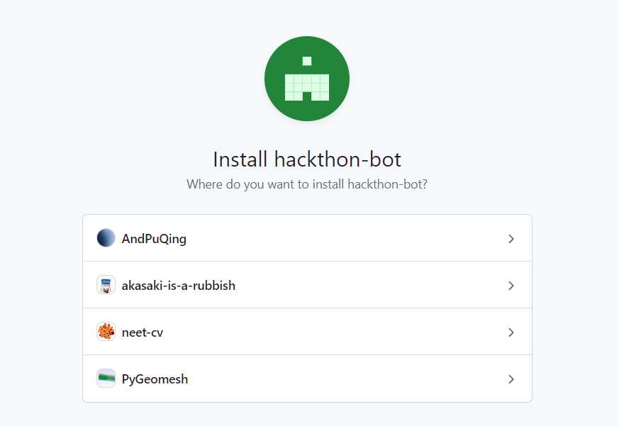
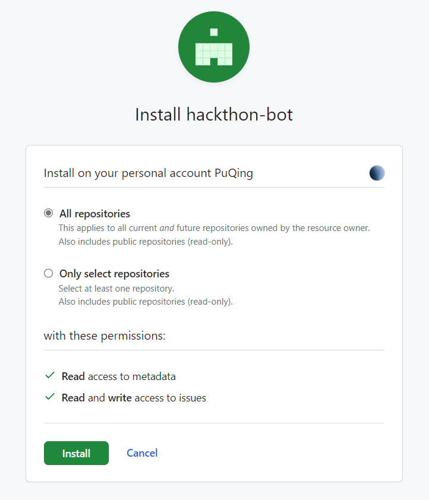

# Hackathon Bot

Hackathon Bot is a GitHub App designed to assist with managing hackathons by automating various tasks.

## Features

- [x] Auto assign claimants to issues
- [x] Support claiming multiple topics at once (e.g., /claim 1,2,3 or /claim 1-3,4)
- [ ] Automatically Link Issues to Pull Requests Based on PR Title
- [ ] Implement admin commands for enhanced control and management
- [ ] Automatically Assign and Apply Labels Based on PR Title

## User Commands

### Claim

Claim an issue to work on.

```
/claim <issue-number>

/claim <issue-number>,<issue-number>,<issue-number>

/claim <issue-number>-<issue-number>

/claim <issue-number>-<issue-number>,<issue-number>
```

### Unclaim

Unclaim an issue.

```
/unclaim <issue-number>

/unclaim <issue-number>,<issue-number>,<issue-number>
```

## If you want to use this bot in your organization or repository

1. On the [GitHub App page](https://github.com/apps/hackthon-bot) 
   
2. Select the organization or repository you want to use
3. Setting repository permissions
   
4. Install the app
5. Try to use the bot

## Development

> It is recommended to use Yarn to manage dependencies.

```sh
# Install dependencies
yarn
```

```sh
# Run the bot
yarn start
```

You will see the output like this:

```sh
$ yarn start
yarn run v1.22.19
$ probot run ./app.js
INFO (probot): Yay, the app was loaded!
INFO (server): Running Probot v12.3.1 (Node.js: v20.4.0)
INFO (server): Forwarding https://smee.io/92fpBd391fm2EFPK to http://localhost:3000/
INFO (server): Listening on http://localhost:3000
INFO (server): Connected
```

Next step, you need to create a GitHub App and use [smee.io](https://smee.io/) to proxy webhooks to your local development environment.

```sh
# 1. Open the URL http://localhost:3000/ in your browser
# 2. Register a new GitHub App
# 3. Next, you'll get to decide on an app name that isn't already taken. Note: if you see a message "Name is already in use" although no such app exists, it means that a GitHub organization with that name exists and cannot be used as an app name.
# 4. After registering your GitHub App, you'll be redirected to install the app on any repositories. At the same time, you can check your local .env and notice it will be populated with values GitHub sends us in the course of that redirect.
# 5. Restart the server in your terminal (press ctrl + c to stop the server)
# 6. Install the app on a test repository.
# 7. Try triggering a webhook to activate the bot!
```

More details, please refer to [Probot docs](https://probot.github.io/docs/development/#configuring-a-github-app).

## Docker

```sh
# 1. Build container
docker build -t hackthon-bot .

# 2. Start container
docker run -e APP_ID=<app-id> -e PRIVATE_KEY=<pem-value> hackthon-bot
```

## Contributing

If you have suggestions for how hackthon-bot could be improved, or want to report a bug, open an issue! We'd love all and any contributions.

For more, check out the [Contributing Guide](CONTRIBUTING.md).

## License

[ISC](LICENSE) © 2023 PuQing
